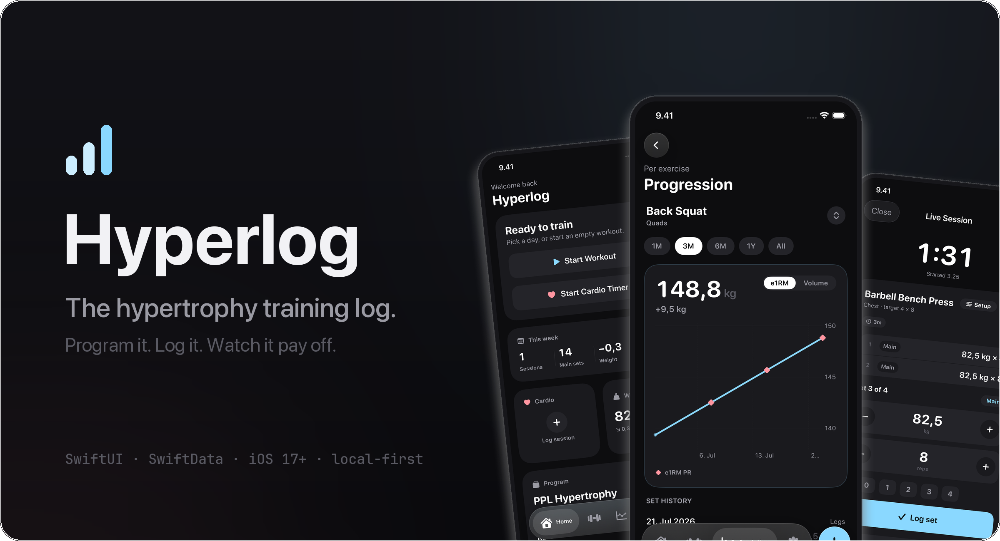
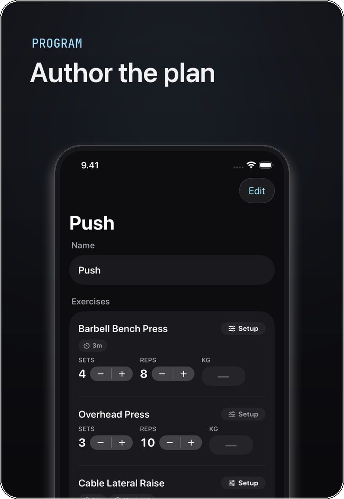
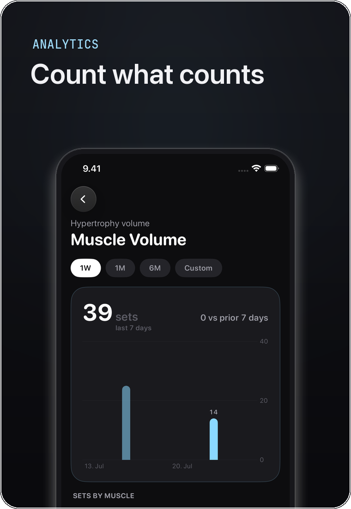
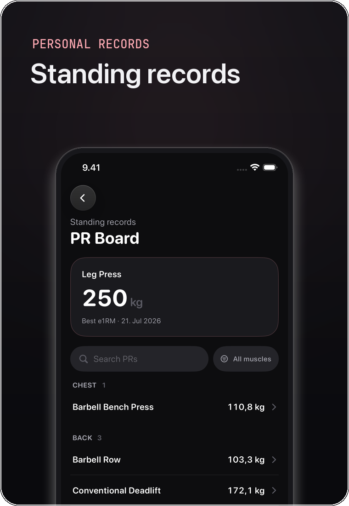
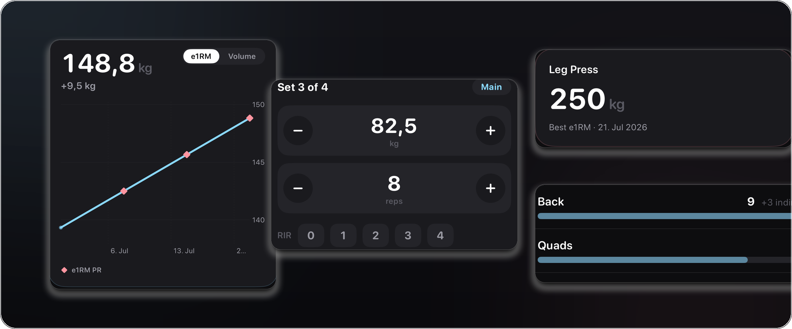
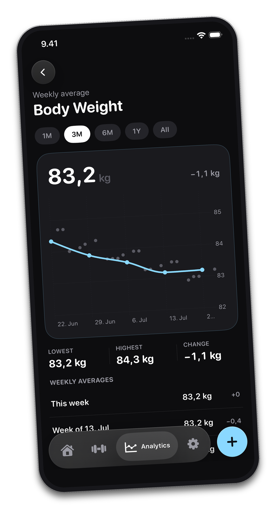
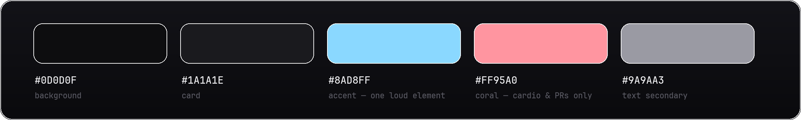

 

**A native iOS training log for people who train in programs, not one-off workouts.**

`Swift` · `SwiftUI` · `SwiftData` · `Swift Charts` · `Supabase` · `iOS 17+`

This repo is the showcase. The source lives in a private repository.

 

## What it does

You author a program as a repeating cycle of days. The app tracks your place in the cycle, so opening it at the gym lands on today's workout with every exercise, target, and rest timer already set. Logging is steppers, not a keyboard: each set arrives pre-filled from the one before, RIR is one tap, and every set carries a tag (warm-up, main, or dropset) so the volume math can ignore warm-ups.

PR detection runs during the session. Estimated 1RM is computed per set as you log it; beat a standing record and the app tells you while you're still on the bench, then files it on the PR board.

 

&nbsp;
&nbsp;

 

## Up close

The progression chart with PR markers, the set logger, a standing record, weekly sets by muscle.

 

## Body weight and cardio

Daily weigh-ins are noisy, so the chart pushes them back into grey dots and draws the weekly average over them. The trend gets the accent; the noise doesn't.

Cardio sessions have their own timer and their own trend. Live workouts survive force-quits, and an idle reminder catches the session you forgot to end. Everything works offline, and everything exports to JSON or CSV.

 

## Design

The app is dark only, and quiet by rule: one full-saturation element per screen, usually the primary button or the hero line on a chart. Everything else is monochrome, and numbers get their hierarchy from size and weight rather than color. Coral has exactly two meanings, cardio and personal records, which is why a coral diamond on a progression line needs no legend.

The rules live in a token layer (spacing scale, radii, type ramp, shared motion), not in per-screen styling.

## How it's built

The domain layer is plain Swift. `ProgramEngine`, `SessionEngine`, and the analytics engines (progression, muscle volume, PRs, trends) have no UI imports and are tested directly; SwiftUI feature modules sit on top, with the design tokens in a shared layer.

Persistence is SwiftData with versioned schemas. There are thirteen of them so far. Every schema change ships as an explicit migration stage, some with custom data backfill, and each has its own migration tests, because losing a user's training history to a lazy migration is the one unforgivable bug in a logging app.

Sync came later, and the pivot is documented: the app started local-only (ADR-0001), then moved to local-first with a Supabase backend (ADR-0002). SwiftData acts as the on-device cache and write queue, Postgres with row-level security is canonical, and the app stays fully usable offline.

The process is unusually documented for a solo project: architecture decision records, a domain glossary, a written visual-language spec, and about 37 vertical-slice issue docs. Around 223 tests cover domain logic, persistence, migrations, and the sync engine.

The screenshots on this page came from a script. It seeds demo data, deep-links into each screen with launch arguments, and polls the simulator framebuffer until it stops changing before capturing, so twelve app states come out reproducible in one command.

 

<a href="https://github.com/anik7afk">Mehedi Haque</a>

